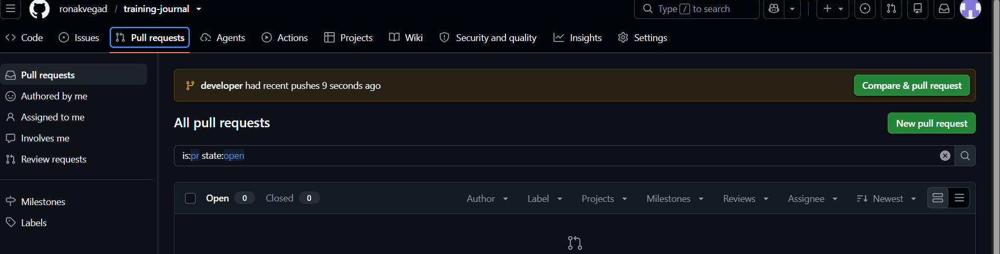
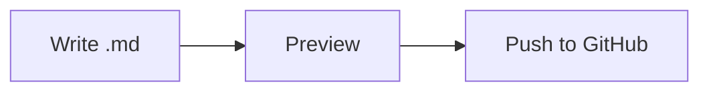

# Section 8 : MarkDown
# Markdown Learning Guide

A hands-on file. Open it in a Markdown previewer (VS Code: `Ctrl+Shift+V`) and compare the raw text with the rendered result.

---

## 1. Headings

```md
# H1
## H2
### H3
#### H4
```

Use one `#` per level. Keep a space after the `#`.

---

## 2. Text Formatting

| You write | You get |
|-----------|---------|
| `**bold**` | **bold** |
| `*italic*` | *italic* |
| `***bold italic***` | ***bold italic*** |
| `~~strikethrough~~` | ~~strikethrough~~ |
| `` `inline code` `` | `inline code` |

---

## 3. Paragraphs & Line Breaks

A blank line starts a new paragraph.
To force a line break, end a line with two spaces or a backslash.

---

## 4. Lists

**Unordered**

- Item one
- Item two
  - Nested item (indent 2 spaces)
  - Another nested item

**Ordered**

1. First
2. Second
3. Third

**Task list**

- [x] Learn headings
- [x] Learn lists
- [ ] Learn tables
- [ ] Learn code blocks

---

## 5. Links

```md
[Link text](https://www.markdownguide.org)
[Link with title](https://www.markdownguide.org "Markdown Guide")
<https://www.markdownguide.org>
```

[Markdown Guide](https://www.markdownguide.org)

**Reference-style links**

```md
Check [this site][guide] for more.

[guide]: https://www.markdownguide.org
```

---

## 6. Images

```md


```

Same as a link, but with a `!` in front.

---

## 7. Blockquotes

> This is a quote.
>
> > Nested quote.

---

## 8. Code

Inline: use `backticks`.

Fenced block with syntax highlighting:

```python
def greet(name):
    return f"Hello, {name}!"
```

```bash
git add .
git commit -m "learn markdown"
```

```json
{ "name": "ronak", "learning": "markdown" }
```

---

## 9. Tables

```md
| Name  | Role     | Score |
|:------|:--------:|------:|
| Alice | Dev      |    90 |
| Bob   | DevOps   |    85 |
```

| Name  | Role     | Score |
|:------|:--------:|------:|
| Alice | Dev      |    90 |
| Bob   | DevOps   |    85 |

Colons in the separator row control alignment: `:--` left, `:-:` center, `--:` right.

---

## 10. Horizontal Rule

Any of these works: `---`, `***`, `___`

---

## 11. Escaping Characters

Use a backslash to show a literal special character:

\*not italic\*  \# not a heading  \[not a link\]

---

## 12. Footnotes (GitHub / extended Markdown)

Here's a statement with a footnote.[^1]

[^1]: This is the footnote text.

---

## 13. Collapsible Section (GitHub)

<details>
<summary>Click to expand</summary>

Hidden content goes here. Markdown works inside too.

</details>

---

## 14. Mermaid Diagram (GitHub / many previewers)



---

## 15. Practice Section

Try these yourself below:

1. Write a heading with your name.
2. Make a bulleted list of 3 skills.
3. Add a link to your GitHub.
4. Create a table of 3 projects with a status column.
5. Add a code block with your favorite snippet.

<!-- This is a comment. It won't show in the rendered output. -->

---

## Quick Cheat Sheet

| Element | Syntax |
|---------|--------|
| Heading | `# H1` `## H2` |
| Bold | `**text**` |
| Italic | `*text*` |
| Link | `[text](url)` |
| Image | `` |
| Code | `` `code` `` |
| Code block | ```` ``` ```` |
| Quote | `> text` |
| List | `- item` / `1. item` |
| Task | `- [ ] todo` |
| Table | `\| a \| b \|` |
| Divider | `---` |

Happy learning! 🚀